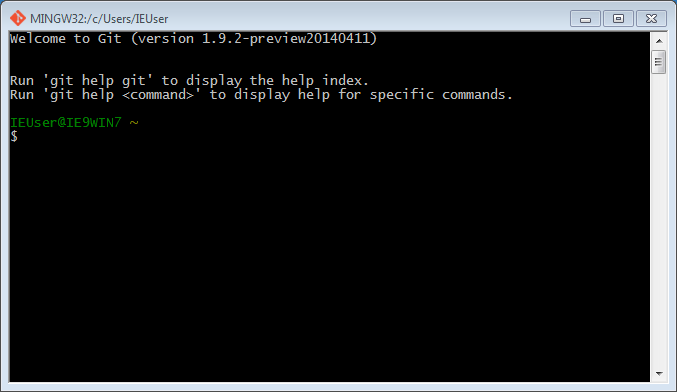

實戰範例使用 `Git` 管理程式碼，以 `tag` 的方式來區分個章節、步驟，我們可以很方便的透過一個簡單的指令來讓當前目錄下的範例程式重新回到某個步驟時的原始狀態。這邊我們將會說明如何使用我們所提供的範例程式碼。

GitHub: [nodejs-tw/nodejs-book-beginner-guide-example](https://github.com/nodejs-tw/nodejs-book-beginner-guide-example)

### Git 安裝

首先沒有安裝 `Git` 的讀者們可依照下面的方式來安裝。

#### Windows

在 Windows 上安裝 Git 非常容易，我們到 [http://msysgit.github.com/](http://msysgit.github.com/) 下載最新版本的 `Git Source Code Mirror`，點擊安裝程式後會看到這個畫面。


直接 `Next` 到底！

完成後我們可以在 `開始` 裡面找到 `Git bash`，我們之後的所有操作都會在這完成。



#### Debian/Ubuntu

```bash
$ apt-get install git
```

#### Fedora

```bash
$ yum install git-core
```

#### Mac

```bash
$ brew install git
```

### 下載範例程式

```bash
$ get clone https://github.com/nodejs-tw/nodejs-book-beginner-guide-example.git
```

### 列出所有章節範例

```bash
$ git tag
```

### 載入範例程式

從剛剛列出的範例中挑選一個範例，使用 `checkout` 指令，這邊加上 `-f` 是為了拋棄所有修改。

```bash
$ git checkout -f 2.1-1
```
