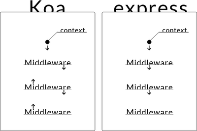

# Koa - 下一個時代的 NodeJS Framework

當我們想要建立一個網站時，我們可能需要處理網址與頁面/檔案的對應，解析 HTTP 請求送出的資料，返回一個檔案時要建立一個 File Stream、設定 Header......

這些事情瑣碎，而且每次都一定會遇到，這時候我們就需要一個簡單的 Framework 幫我們處理掉這些事情，而 Koa 正是這樣的 Framework。

## 怎麼聽起來跟 Express 很像？

Koa 或許可能還不是很多人知道，但是 Express 大家應該聽過。Koa 是 Express 作者群去年新開使的一個專案，要處理的事情跟 Express 相近，但使用了一些 ES6 新語法上的特性，並把很多功能拆散。Express 本身 Middleware 機制（包含 session、body parser 等內建 middleware）是交給另一個模組 “Connect” 去處理，本身則是把 Connect 鬆散的架構串起來，並在 req、res 上添加一些常會需要的方法 。Koa 則是把這兩部分合併、精簡，只留下了主要的 Middleware 機制還有 Request、Response，原來 Connect 預設的 Middleware 都被丟棄，像是 session 我們就必須另外裝模組。這樣好處是比較彈性，以前因為 Routing 機制是內建的，所以只有很簡易的 API 可以操作，維護/開發起來不是很方便，我們能做的就是自己寫 Script 或是找一個更上層的 Framework 來讓開發更便利，但是現在不必了，我們可以針對某個功能去找需要的模組，Koa 目前就已經要好幾個 router 可以選擇。

## Middleware 機制

koa 的 middleware 機制使用了 ECMAScript 6 的 Generators，在想法上面大致與 Connect 相同但還是有一些差異存在，在 Connect 裡每個 Middleware 中只要呼叫了 next 通常後面程式碼我們就不會讓他繼續執行，因為我們不想讓同一時間同一個 request 處理兩件事情，所以 next 也可以看作是當前 Middleware 的 “__終止__”，但在 koa 裡面就不是這樣，next 在這邊不是終止，而是 “__暫停__”，這其實是一個 Generators 的特性。這小小的特性改變會造成我們在解決問題時思考上面的差異，先看看這張圖片，他展示了我們程式帶著 `context` 所執行的方式



## 常用 Middleware

如果想直接看範例話請點[這裡](#example)

### koa-send

GitHub: [https://github.com/koajs/send](https://github.com/koajs/send)

koa 下允許我們把想回傳的資料塞給 context.body，像是 String（HTML）、Object（JSON）、Stream（File），如果要丟一個檔案我們可以這樣寫

```javascript
app.use(function *(next) {
  this.body = fs.createReadStream(filepath);
});
```

但是這樣不是安全，他可能會遇到一些錯誤，多數情況我們也要設定 Content-Length, MIME Type 等其他欄位，所以就有 koa-send，一般使用上我們可以把他當作以前的 res.sendfile() 來使用。

```javascript
app.use(function *(next) {
  yield send(this, filepath);
});
```

### koa-static

GitHub: [https://github.com/koajs/static](https://github.com/koajs/static)

koa-static 等同於以前的 express.static、connect.static，幫我們處理掉所有靜態檔案，這邊有趣的在於他的 Middleware 寫法，以前 Express, Connect 是無法做到的。

```javascript
// …
  return function *(next) {
    yield next;
    // response is already handled
    if (!this.idempotent || this.body != null || this.status != null) return;
    yield send(this, this.path, opts);
  }
// …
```

他先跑了之後的所有 Middleware，跑完之後判斷是不是已經有資料要回傳了，如果沒有需要回傳的資料就 send 檔案。

### koa-router

GitHub: [https://github.com/alexmingoia/koa-router](https://github.com/alexmingoia/koa-router)

koa-router 是目前功能最完整的 router，他提供了一些很彈性的方式來建立 route，部分用法沿襲 Express 大家習慣的 app.get, app.post 這些方法，也有新加很多其他的 API，包含以前一些 Framework 會作的事，像是 route 命名，透過命成產生 url。

在 koa-router 中有一個比較特別的功能 “Multiple routers” 我覺得需要特別題一下，因為如果善用 koa 原來特性的話其實很容易就做到同樣事情。

koa-router 允許我們建立很多 router 然後指派不同的 path 上面，讓整個程式碼看起來比較清楚，也可以一次改變一整個 router 下面所有的路徑。o

```javascript
// koa-router README.md
var APIv1 = new Router(),
  APIv2 = new Router();

APIv1.get(‘/sign-in’, function *() {
  // …
});
APIv2.get(‘/sign-in’, function *() {
  // …
});
app.use(mount(‘/v1', APIv1.middleware()));
app.use(mount(‘/v2', APIv2.middleware()));
```

這邊示範如何用 koa 原生的方式做到類似的事情，其實就只是多一個 middleware 而已。

```javascript
var app = koa(),
  api = {};

api.v1 = appToMiddleware(koa());
api.v2 = appToMiddleware(koa());
app.use(function *(next) {
  // 取得版本號
  var match = this.url.match(/\/v\d+/),
    v = match && match[1];

  if (v && api[v]) {
    // 如果版本號存在，就把執行這個 sub app。
    // 這邊使用 call 來讓 sub app 所有的 middleware 的 context
    // 跟當前 context 相同，這樣 sub app 裡面才有辦法取得 req, res。
    yield api[v].call(this, next);
  } else {
    // 如果不存在就執行下一個 middleware
    yield next;
  }
});
// 將 app 轉成可被 use 的 middleware
function appToMiddleware(app) {
  // 取得 app 的所有 middleware，這邊會是一個 Arry
  var middleware = app.middleware,
    len = middleware.length;
  // 回傳 middleware
  return function *(next) {
    // 多建立 len 只是想避免重複計算陣列長度
    var i = len,
      curr;
    while (i—) {
      // curr 會是一個 generator function。
      // 用當前 context 還有 “上一個” middleware 取得 generator。
      // 最後被執行的 middleware 會先被產生然後包在最內層
      curr = middleware[i];
      next = curr.call(this, next);
    }
    // 開始執行 app 裡的所有 middleware
    yield *next;
  };
}
```

### koa-session

GitHub: [https://github.com/koajs/session](https://github.com/koajs/session)

等同於 express.session, connect.session

### koa-compose

GitHub: [https://github.com/koajs/compose](https://github.com/koajs/compose)

合併多個 Middleware 成一個 Middleware

```javascript
var compose = require(‘koa-compose’);
// …
app.use(compose([middleware1, middleware2, middleware3]));
```

### koa-mount

GitHub: [https://github.com/koajs/mount](https://github.com/koajs/mount)

因為 Koa 處理的事情非常單純，所以只要把兩個 app 的 Middleware 串起來，並讓 Context 正確傳遞就能合併兩個 app

```javascript
var mount = require(‘koa-mount’);
// …
app.use(mount(‘/hello’, app2));
app.use(mount(‘/world’, app3));
```

## 實際範例

這範例非常基礎，並不是一個好的架構，透過他可以了解如何用最基本的方式建立網站，但是實際上不要這樣用。

#### 1. 初始化

開一個新目錄，輸入下面的指令然後 Enter 到底！

```bash
$ npm init
```

#### 2. 設定 `npm start` 指令

打開 package.json 找到 `scripts`，在他裡面加入下面這一行

```javascript
"start": "node app.js"
```

#### 3. 安裝 Koa

```bash
$ npm install --save koa koa-router
```

#### 4. 建立 app.js

```javascript
// app.js
var koa = require('koa'),
  router = require('koa-router');
```

#### 5. 建立 app

```javascript
// app.js
var app = koa();
```

#### 6. Routing

```javascript
// app.js
app.use(router(app));

app.get('/hello/:name', function *(next) {
  var name = this.params.name || 'World';
  this.body = 'Hello ' + name + ' !';
});
```

#### 7. 設定監聽的 port

```javascript
// app.js
app.listen(3000);
```

#### 8. 啟動 Server

```bash
$ npm start
```

#### 9. 瀏覽看看！

打開 Browser，在網址列輸入 `http://localhost:3000/hello/poying`
